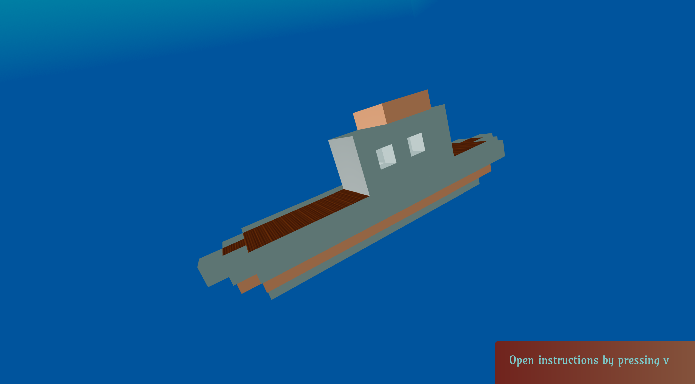

# OceanBuilder

An app built to show how WebGL can be used with React to create 3D immersive experiences suitable for metaverse applications. This particular experience places the user in an underwater setting where they can build 3D models.

## URL for App Website

The app is deployed at https://ocean-builder.netlify.app/.

## Launching the App Locally

This app assumes that you have yarn installed. After git cloning this repo, you can then run the command `yarn dev`. Then click the `Begin` button.

## Building the 3D Model

You start with one cube. You can then click on any of the sides of this cube to glue on a new cube. You can change the texture of the cube by pressing a number key. Cubes can be 'dirt' (press 1); 'iron' (press 2); 'copper'(press 3); 'wood' (press 4) or 'glass' (press 5). Pressing the key 0 disables the addition of new cubes. Cubes can be deleted by holding the Alt key whilst clicking on a cube.

## Moving Around

- Press w to move forward, a to move left, d to move right and s to move backward.
- Press x to ascend and z to descend.

## Looking Around

- Press i to pitch upwards
- Press k to pitch downwards
- Press j to yaw left
- Press l to yaw right
- Press u to roll left
- Press o to roll right

## Saving Progress

The 3D model can be saved by pressing the t key. The screen can be reset by pressing r.

## Accessing on-screen instructions

On-screen instructions will open up when you press v and can be closed by again pressing v.
